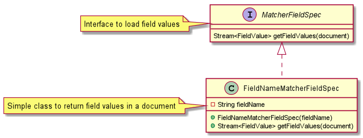

# MatcherFieldSpec  
 

# MatcherQueryVisitor  
 

# FilterFactory  
####This produces the VISITABLE filter.  
 

# MatcherQuery  
 
 
# FilterMapper  
 
  
####  Usage example:  To filter a document on `CONTENT_PRIMARY` containing `address` 
    Filter<String> filter = FilterFactory.contains("CONTENT_PRIMARY", "address");
    MatcherQuery.isMatch(document, FilterMapper.map(filter, FieldNameMatcherFieldSpec::new));

